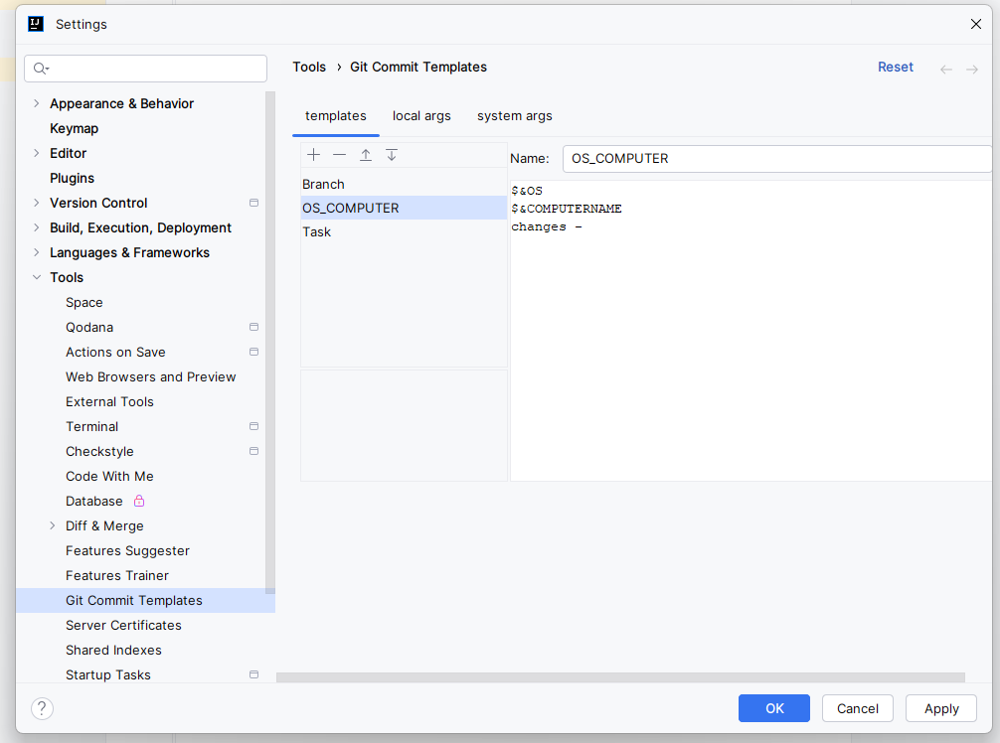
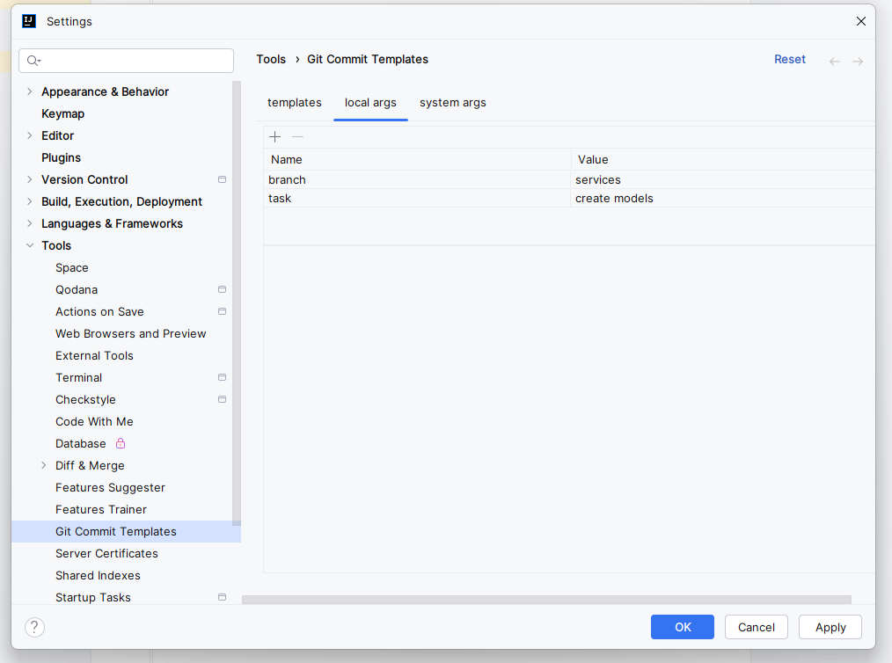
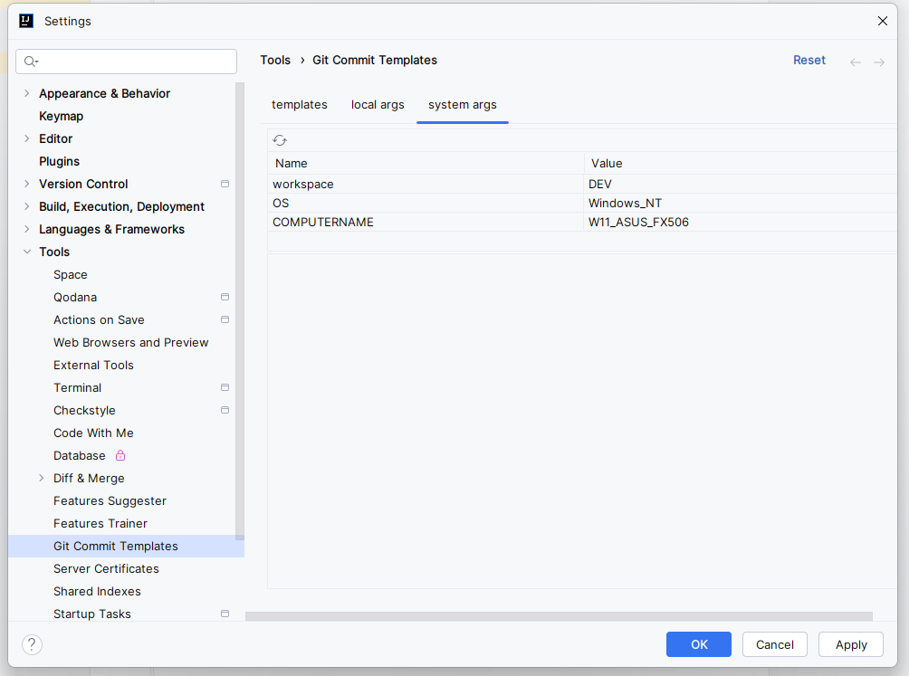
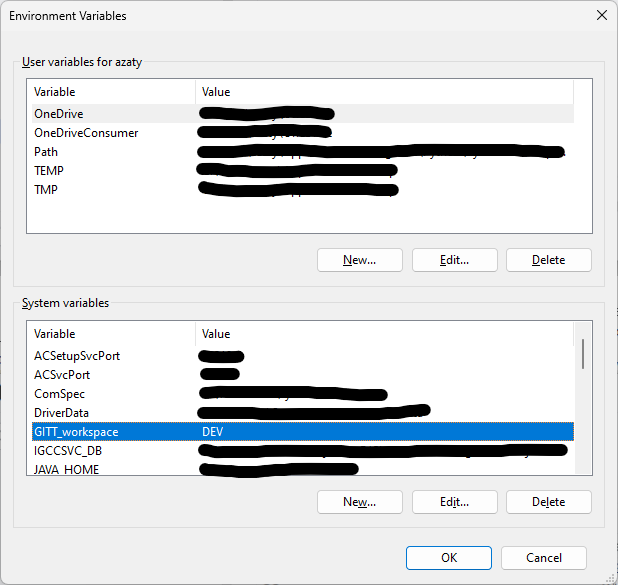
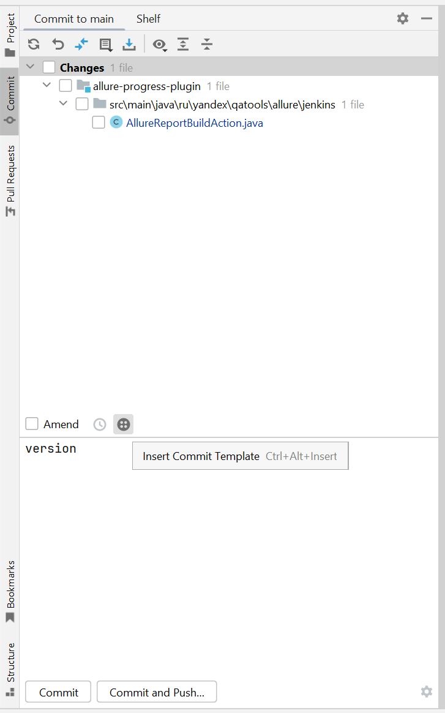
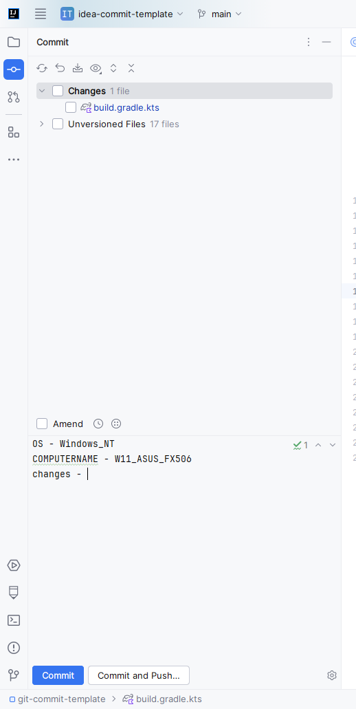

# Использование

# Настройки

Настройка плагина может быть осуществлена по пути File -> Settings -> Tools -> Git Commit Templates
1. На вкладке templates можно добавить новые шаблоны(название и сам шаблон)
  

2. На вкладке local args можно добавить переменные, которые будут вставлены в шаблоны при включении $* + имя_переменной в шаблон
  

3. На вкладке system args отображен список переменных окружения, которые можно вставить в шаблон при включении $& + имя_переменной в шаблон.
  

4. По умолчанию в списке присутствуют значения OS и COMPUTERNAME(на Windows). Добавление в этот список новых переменных осуществляется через определение переменной окружения, в названии которой есть приставка GITT_. При каждом добавлении/удалении системной переменной окружения нужно будет перезарустить Intellij Idea для того, чтобы список обновился.
  

# Вставка шаблона

1.При написании сообщения коммита будет доступна кнопка Insert Commit Message
  

2. При нажатии на нее откроется окно со списком указанных в настройках шаблонов
 

3. При выборе одного из шаблонов и нажатия Select шаблон будет вставлен как сообщение коммита
  

4. При выборе одного из шаблонов и активирования чекбокса Add branch name шаблон будет вставлен как сообщение коммита и название ветки будет добавлено в начало коммита
  

