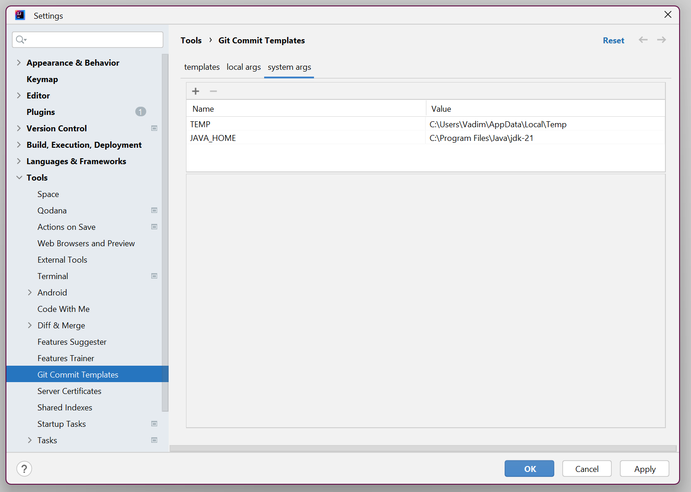
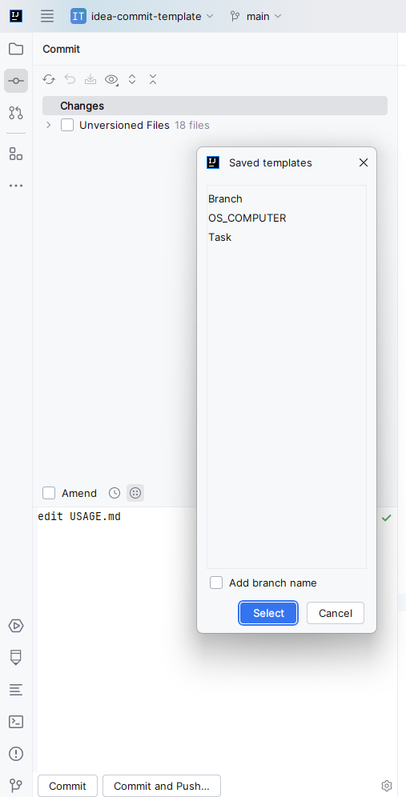
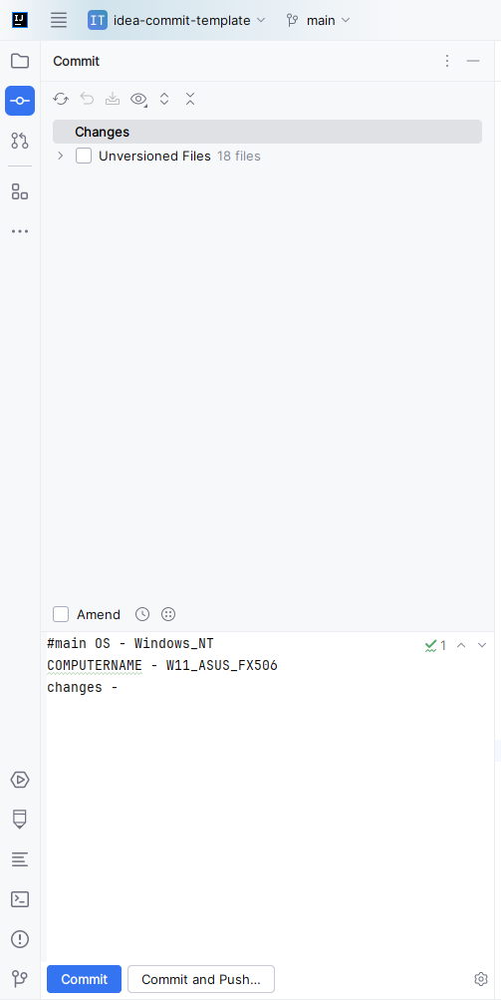

# Использование

# Настройки

Настройка плагина может быть осуществлена по пути File -> Settings -> Tools -> Git Commit Templates
1. На вкладке templates можно добавить новые шаблоны(название и сам шаблон)
  

2. На вкладке local args можно добавить переменные, которые будут вставлены в шаблоны при включении $* + имя_переменной в шаблон
  

3. На вкладке system args отображен список переменных окружения, которые можно вставить в шаблон при включении $& + имя_переменной в шаблон.
  

4. Добавление в этот список новых переменных осуществляется через кнопку `Add` и выбора переменной среды из списка
  

# Вставка шаблона

1.При написании сообщения коммита будет доступна кнопка Insert Commit Message (для неё так же доступен хоткей)
  

2. При нажатии на нее откроется окно со списком указанных в настройках шаблонов
  

3. При выборе одного из шаблонов и нажатия Select шаблон будет вставлен как сообщение коммита
  

4. При выборе одного из шаблонов и активирования чекбокса Add branch name шаблон будет вставлен 
   как сообщение коммита и название ветки будет добавлено в начало коммита
  
  

